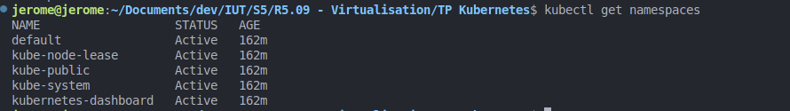
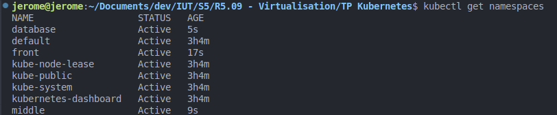
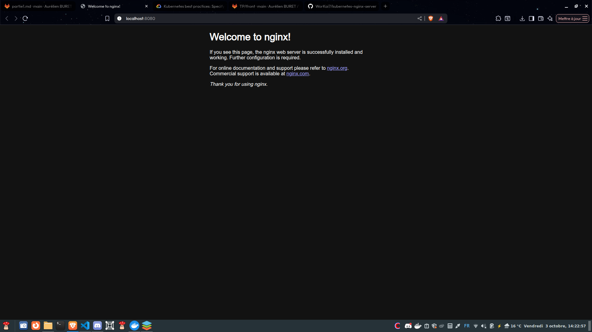

# Rendu TP Virtualisation - Jérôme Vandewalle

## Partie 1

Visualisation des namespaces avant création:
- ```kubectl get namespaces```



Création des namespaces:
- ```kubectl apply -f ./front/namespace.yaml```
- ```kubectl apply -f ./middle/namespace.yaml```
- ```kubectl apply -f ./database/namespace.yaml```

Visualisation des namespaces après création:
- ```kubectl get namespaces```




## Partie 2

### Questions et commandes utilisées:

#### Question 3:

Déploiement des fichiers dans le namespace front
(J'ai choisi de le spécifier dans la ligne de commande plutôt que de modifier les fichier)
- ```kubectl apply -f ./front/nginx-deployment.yaml --namespace=front```
- ```kubectl apply -f ./front/nginx-service.yaml --namespace=front```

#### Question 4:

Pour vérifier les events du namespace front:
- ```kubectl get events -n front```

Pour vérifier les pods et leurs conteneurs:
- ```kubectl get pods -n front```

#### Question 5:

Redirection du port:
- ```kubectl port-forward -n front svc/nginx 8080:8383```

#### Question 6:

Résultat lorsque je vais sur localhost:8080:



#### Question 7:

Le schéma représente un noeud qui contient 2 pods qui chacun contiennent un conteneur nginx

#### Question 8:

Le schéma représente un cluster qui rassemble le noeud et le service