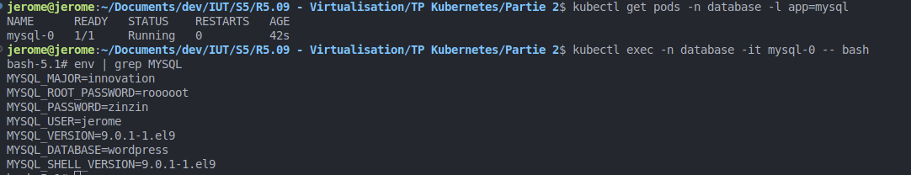
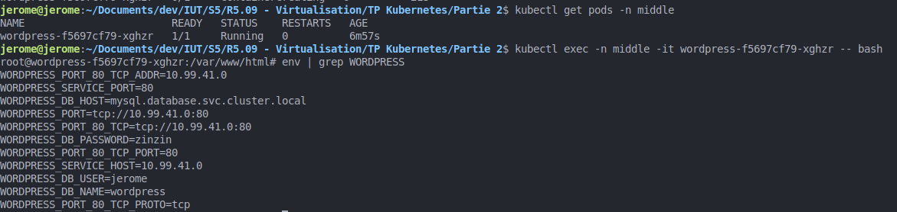
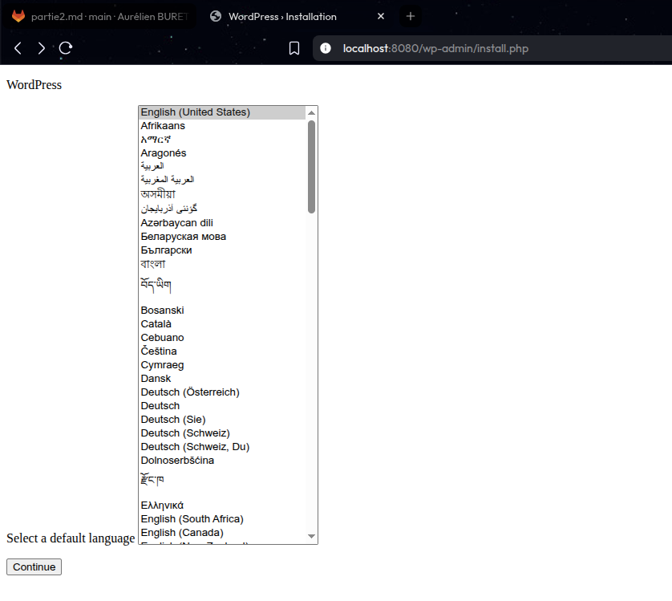

# Rendu TP Virtualisation - Jérôme Vandewalle

## Partie 2

## ----------

## MySQL

Après avoir créé les 4 ressources (Secret, ConfigMap, StatefulSet et Service) pour la base de données mysql, il faut les appliquer :
- ```kubectl apply -f ./database/mysql-secret.yaml -n database```
- ```kubectl apply -f ./database/mysql-configmap.yaml -n database```
- ```kubectl apply -f ./database/mysql-statefulset.yaml -n database```
- ```kubectl apply -f ./database/mysql-service.yaml -n database```

Une fois cela fait, on doit récupérer le nom du pod en cours qui a été créé pour pouvoir entrer dans son terminal après :

- ```kubectl get pods -n database -l app=mysql```

Sortie :

```
NAME      READY   STATUS    RESTARTS   AGE
mysql-0   1/1     Running   0          42s
```

Nous avons donc le nom ```mysql-0``` et nous allons l'utiliser pour entrer dans le terminal du pod en question

- ```kubectl exec -n database -it mysql-0 -- bash```

On se retrouve maintenant dans la console du pod avec cette ligne qui nous est présentée :

- ```bash-5.1# ```

Nous allons maintenant vérifier la présence des 4 variables d'environnement créée avec cette commande :

- ```env | grep MYSQL```

Puis nous avons la sortie suivante :

```
MYSQL_MAJOR=innovation
MYSQL_ROOT_PASSWORD=rooooot
MYSQL_PASSWORD=zinzin
MYSQL_USER=jerome
MYSQL_VERSION=9.0.1-1.el9
MYSQL_DATABASE=wordpress
MYSQL_SHELL_VERSION=9.0.1-1.el9
```

Nous voyons bien que nos variables d'environnement sont présentes et bien spécifiées selon ce que nous avons écrit dans les fichiers YAML




## Wordpress

Après avoir créé les 4 fichiers, je les applique comme pour la partie MySQL :

- ```kubectl apply -f ./database/wordpress-pv.yaml -n middle```
- ```kubectl apply -f ./middle/wordpress-pvc.yaml -n middle```
- ```kubectl apply -f ./middle/wordpress-deployment.yaml -n middle```
- ```kubectl apply -f ./middle/wordpress-service.yaml -n middle```

Je récupère le nom du pod créé :

- ```kubectl get pods -n middle```

Sortie :
```
NAME                        READY   STATUS    RESTARTS   AGE
wordpress-f5697cf79-xghzr   1/1     Running   0          6m57s
```

On entre dans la console du pod :

- ```kubectl exec -n middle -it wordpress-f5697cf79-xghzr -- bash```

Puis on entre la même commande pour vérifier les variable mais avec le mot clé WORDPRESS :

- ```env | grep WORDPRESS```

Sortie :

```
WORDPRESS_PORT_80_TCP_ADDR=10.99.41.0
WORDPRESS_SERVICE_PORT=80
WORDPRESS_DB_HOST=mysql.database.svc.cluster.local
WORDPRESS_PORT=tcp://10.99.41.0:80
WORDPRESS_PORT_80_TCP=tcp://10.99.41.0:80
WORDPRESS_DB_PASSWORD=zinzin
WORDPRESS_PORT_80_TCP_PORT=80
WORDPRESS_SERVICE_HOST=10.99.41.0
WORDPRESS_DB_USER=jerome
WORDPRESS_DB_NAME=wordpress
WORDPRESS_PORT_80_TCP_PROTO=tcp
```

Nous voyons encore une fois que les variables sont bien présentes




## NGINX

Après avoir créé le fichier ConfigMap et modifé les fichiers deployment et service de NGINX, on les applique :

- ```kubectl apply -f ./front/nginx-configmap.yaml -n front```
- ```kubectl apply -f ./front/nginx-deployment.yaml -n front```
- ```kubectl apply -f ./front/nginx-service.yaml -n front```

Enuite, on port-forward pour avoir accès à la page:

- ```kubectl port-forward -n front svc/nginx 8080:8383```

Puis on y accède dans le navigateur avec le lien ```localhost:8080/wp-admin/install.php```




## Questions

1) Pour vérifier cela, on peut vérifier manuellement 1 par 1 chaque ressource pour chaque namespace :

- ```kubectl get <ressource> -n <namespace>```
- Exemple pour les pods : ```kubectl get pods -n front```
```
NAME                                READY   STATUS    RESTARTS   AGE
nginx-deployment-5996c787bc-g85lk   1/1     Running   0          52m
nginx-deployment-5996c787bc-hdfzz   1/1     Running   0          52m
```

Mais on peut également exécuter une commande globale :

- ```kubectl get all --all-namespaces```

```
NAMESPACE              NAME                                             READY   STATUS    RESTARTS        AGE
database               pod/mysql-0                                      1/1     Running   0               5h17m
front                  pod/nginx-deployment-5996c787bc-g85lk            1/1     Running   0               53m
front                  pod/nginx-deployment-5996c787bc-hdfzz            1/1     Running   0               53m
...

NAMESPACE              NAME                                TYPE        CLUSTER-IP       EXTERNAL-IP   PORT(S)                  AGE
database               service/mysql                       ClusterIP   10.107.88.244    <none>        3306/TCP                 5h17m
default                service/kubernetes                  ClusterIP   10.96.0.1        <none>        443/TCP                  14d
front                  service/nginx                       ClusterIP   10.96.135.245    <none>        8383/TCP                 69m
...

```


2) Les ressources MySQL sont à déployer dans ces 2 namespaces car Wordpress à besoin des informations de connexion à la base de données, et les pods qui sont dans différents namespaces ne peuvent pas accéder aux données des autres namespaces, il est donc nécessaire de déployer ces ressources dans le namespace middle pour que Wordpress puisse récupérer les données de la BDD également.

3) Pour vérifier si les pods sont en train de tourner, il faut effectuer la commande suivante :

```kubectl get pods -n <namespace>```

Exemple :

```kubectl get pods -n middle```

```
NAME                        READY   STATUS    RESTARTS   AGE
wordpress-84f8f99b8-9dcdf   1/1     Running   0          21m
```

4) Pour accéder aux events d'un namespace, il s'agit de la commande suivante :

- ```kubectl get events -n <nom-du-namespace>```

Exemple :

- ```kubectl get events -n middle```

```
LAST SEEN   TYPE     REASON              OBJECT                            MESSAGE
23m         Normal   Scheduled           pod/wordpress-578bd7667f-wcr5n    Successfully assigned middle/wordpress-578bd7667f-wcr5n to minikube
23m         Normal   Pulling             pod/wordpress-578bd7667f-wcr5n    Pulling image "wordpress:latest"
23m         Normal   Pulled              pod/wordpress-578bd7667f-wcr5n    Successfully pulled image "wordpress:latest" in 3.577s (3.577s including waiting). Image size: 733721039 bytes.
23m         Normal   Created             pod/wordpress-578bd7667f-wcr5n    Created container: wordpress
23m         Normal   Started             pod/wordpress-578bd7667f-wcr5n    Started container wordpress
23m         Normal   Killing             pod/wordpress-578bd7667f-wcr5n    Stopping container wordpress
23m         Normal   SuccessfulCreate    replicaset/wordpress-578bd7667f   Created pod: wordpress-578bd7667f-wcr5n
23m         Normal   SuccessfulDelete    replicaset/wordpress-578bd7667f   Deleted pod: wordpress-578bd7667f-wcr5n
39m         Normal   Scheduled           pod/wordpress-66d8fb6744-lbw9p    Successfully assigned middle/wordpress-66d8fb6744-lbw9p to minikube
39m         Normal   Pulling             pod/wordpress-66d8fb6744-lbw9p    Pulling image "wordpress:latest"
...
```

Pour accéder aux logs d'un pod :

- ```kubectl logs <nom-du-pod> -n <namespace>```

Exemple :

- ```kubectl logs wordpress-84f8f99b8-9dcdf -n middle```

```
AH00558: apache2: Could not reliably determine the server's fully qualified domain name, using 10.244.0.43. Set the 'ServerName' directive globally to suppress this message
AH00558: apache2: Could not reliably determine the server's fully qualified domain name, using 10.244.0.43. Set the 'ServerName' directive globally to suppress this message
[Fri Oct 17 13:56:26.255759 2025] [mpm_prefork:notice] [pid 1:tid 1] AH00163: Apache/2.4.65 (Debian) PHP/8.3.26 configured -- resuming normal operations
[Fri Oct 17 13:56:26.255789 2025] [core:notice] [pid 1:tid 1] AH00094: Command line: 'apache2 -D FOREGROUND'
127.0.0.1 - - [17/Oct/2025:13:56:35 +0000] "GET / HTTP/1.0" 302 382 "-" "Mozilla/5.0 (X11; Linux x86_64) AppleWebKit/537.36 (KHTML, like Gecko) Chrome/138.0.0.0 Safari/537.36"
127.0.0.1 - - [17/Oct/2025:13:57:44 +0000] "GET / HTTP/1.0" 302 382 "-" "Mozilla/5.0 (X11; Linux x86_64) AppleWebKit/537.36 (KHTML, like Gecko) Chrome/138.0.0.0 Safari/537.36"
127.0.0.1 - - [17/Oct/2025:13:57:50 +0000] "GET /wp-admin/install.php HTTP/1.0" 200 4640 "-" "Mozilla/5.0 (X11; Linux x86_64) AppleWebKit/537.36 (KHTML, like Gecko) Chrome/138.0.0.0 Safari/537.36"
127.0.0.1 - - [17/Oct/2025:13:58:00 +0000] "GET / HTTP/1.0" 302 382 "-" "Mozilla/5.0 (X11; Linux x86_64) AppleWebKit/537.36 (KHTML, like Gecko) Chrome/138.0.0.0 Safari/537.36"
```

