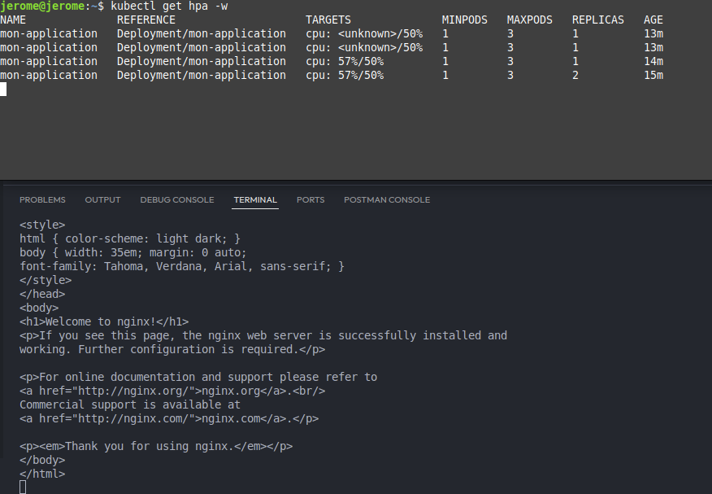

# Rendu TP Virtualisation - Jérôme Vandewalle

## Partie 3

## ----------

## CronJob

Après avoir créé le fichier YAML pour le Cronjob, je l'applique :

- ```kubectl apply -f cronjob.yaml```

Puis je vérifie qu'il ait bien été créé

- ```kubectl get cronjob```

```
NAME   SCHEDULE      TIMEZONE   SUSPEND   ACTIVE   LAST SCHEDULE   AGE
date   */5 * * * *   <none>     False     0        <none>          16s
```

Puis au bout de 5 minutes ou plus, je vérifie qu'un job a bien été créé:

- ```kubectl get jobs```

Après un peu moins de 20 minutes :
```
NAME            STATUS     COMPLETIONS   DURATION   AGE
date-29345190   Complete   1/1           8s         14m
date-29345195   Complete   1/1           5s         9m15s
date-29345200   Complete   1/1           5s         4m15s
```

## HPA

Après avoir créé les fichiers YAML pour l'application et son HPA, on les appliquent:

- ```kubectl apply -f application.yaml```
- ```kubectl apply -f hpa-application.yaml```

4) Pour les requests et limit, on veut que lorsque l'utilisation moyenne du cpu du pod est au dessus de 50%, l'application créera un nouveau pod (il y a au départ 1 pod, puis au maximum il peut y en avoir 3). Puis si il y a plus de 1 pod et qu'un pod passe en dessous de 50% d'utilisation moyenne de son cpu, on repassera à 1 pod.

5) ```kubectl expose deployment mon-application --port=80 --type=LoadBalancer```

6) Pour vérifier le HPA, voici les commandes :

D'abord il faut activer metrics-server :

- ```minikube addons enable metrics-server```

Puis voici la commande pour la surveillance

- ```kubectl get hpa -w```

```
NAME              REFERENCE                    TARGETS              MINPODS   MAXPODS   REPLICAS   AGE
mon-application   Deployment/mon-application   cpu: 34%/50%   1         3         1          4m21s
```

7)
- La colonne ```NAME``` désigne le nom de l'application surveillée
- La colonne ```REFERENCE``` désigne la ressource ciblée par l'HPA (ici le Deployment)
- La colonne ```TARGETS``` désigne l'utilisation du CPU en fonction du seuil spécifié dans l'HPA
- La colonne ```MINPODS``` désigne le nombre minimum de pod possible
- La colonne ```MAXPODS``` désigne le nombre maximum de pod possible
- La colonne ```REPLICAS``` désigne le nombre de pod actuel
- La colonne ```AGE``` désigne le temps depuis la création de l'HPA

8)


9) On voit sur l'image ci-dessus que le HPA fonctionne comme voulu, une fois que l'utilisation du cpu est passé a plus de 50%, une deuxième replique à été créée.